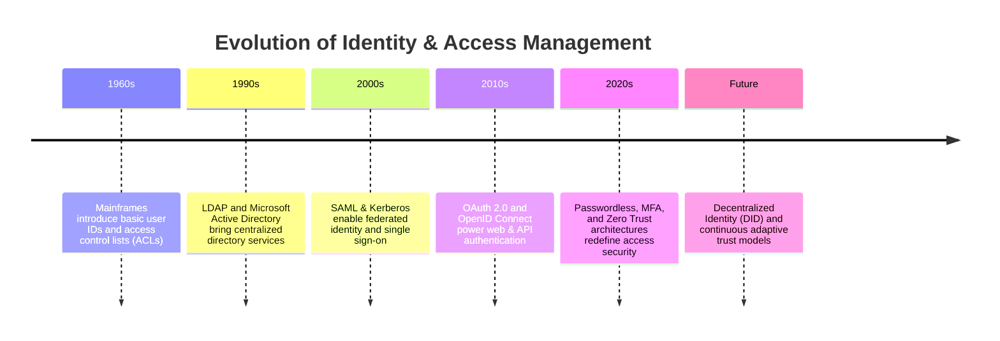
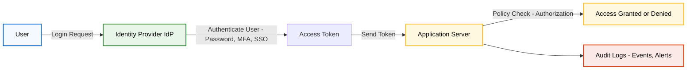

IAM (Identity and Access Management) is like a security guard for a company's digital world, making sure only the right people get into the right places at the right time. It manages who a user is (identity) and what they are allowed to do (access), and it also applies to non-human "identities" like devices or software.

{/* truncate */}

## What is IAM, and why I care

Hey — I’m a software engineer at **Cisco Duo Security**, and every day I deal with identity and access management (IAM) in one form or another. If you’ve ever clicked _“Login with Google”_, approved a MFA push, or reset a password, you’ve interacted with IAM.

At its simplest, IAM is the set of policies, technologies, and workflows that makes sure **the right people (and machines)** have **the right access** to **the right resources** at the right time.

:::info
“Identity and access management (IAM) is the cybersecurity discipline that deals with provisioning and protecting digital identities and user access permissions in an IT system.”
In other words, IAM ensures people can do what they need—and no more. It’s become increasingly important in the cloud-mobile era, because there are more users, more devices, and more kinds of access than ever before. — [DUO IAM Guide](https://duo.com/learn/what-is-identity-and-access-management).
:::

Why I care personally? Because in real systems, unmanaged identities lead to real breaches: orphaned accounts, over-privileged users, and forgotten service credentials are common attack vectors. Good IAM prevents that mess.

---

## A brief history of IAM

### Local logins → directories

In the early days of computing, each system managed its own user accounts. This often meant access-control lists (ACLs) on individual machines: a user had separate logins for email, file servers, databases, etc. As one history notes, “one of the earliest forms of digital identity management was ACLs… which required users to establish their identity on multiple systems”. As companies added more applications, this became too large to manage (each new server meant another login).

### Federation and SSO

As web applications multiplied, we needed a way to sign in once and access many services. Protocols like **SAML 2.0** enabled browser-based federation and Single Sign-On (SSO) emerged, letting users authenticate once and gain access to multiple applications using a single set of credentials. Later, **OAuth 2.0** and **OpenID Connect (OIDC)** made delegated authorization and modern authentication flows possible.

### Cloud, service identities, and Zero Trust

Today identities aren’t just human users — they’re devices, containers, and services. Many organizations shifted to cloud based Identity-as-a-Service (IDaaS) offerings provide scalable, cloud-hosted IAM (including federation and MFA) to bridge on-prem and cloud systems. Simultaneously, zero-trust (no implicit trust; verify every request) and adaptive authentication models have been introduced to verify identities continuously and assess device security posture in real time.

---

## The four pillars of IAM (how I explain it)

When I explain IAM, I always use the **four pillars** — they map to the practical lifecycle you’ll manage.

### 1. Administration (Identity lifecycle)

Creating and managing user accounts and credentials. This ensures every user has a unique digital identity that can be updated or revoked as roles change
Good administration ensures every user or service has a unique identity and that access is removed when it’s no longer needed.

### 2. Authentication (AuthN)

This is to prove "you are who you claim to be" (your identity) by verifying through mechanisms like passwords, multi-factor authentication (MFA), or federated logins via OAuth. Stronger options include push notifications, hardware keys (FIDO/WebAuthn), or biometric flows.

### 3. Authorization (AuthZ)

Once we know who is asking, what can they do? Authorization enforces permissions — implemented via RBAC (roles), ABAC (attributes), or hybrid models. This is where the principle of _least privilege_ is enforced: users get only what they need.

### 4. Auditing (monitoring & governance)

Who did what and when? Logging and auditing give you the answer - Tracking and logging user activity. Audits power compliance reports (GDPR, SOX, HIPAA, PCI) and are essential for incident investigations.

Together those pillars (admin, authentication, authorization, auditing) define the practical controls that keep a system secure.

---

## Core IAM components I work with

Here’s a quick tour of the building blocks you’ll see in modern IAM stacks.

- **Identity/Directory Store**
  The “single source of truth” for identity attributes: username, email, roles, group membership. This might be Active Directory, LDAP, or a cloud directory.

- **Identity Provider (IdP) & Federation**
  IdPs perform authentication and issue tokens/assertions. Federation (SAML, OIDC) lets services accept those tokens from trusted IdPs. Examples: DUO, Okta, Azure AD, Ping, or self-hosted Keycloak.

- **Access Management / Policy Engine**
  This evaluates policies (RBAC/ABAC) and enforces access. It’s also responsible for session handling and Single Sign-On flows.

- **Authentication mechanisms & MFA**
  Passwords, TOTP, push, hardware security keys, biometrics — all live here. Duo Security (and many other vendors) provide MFA and adaptive auth services: [Duo Security](https://duo.com).

- **Identity Governance & Administration (IGA)**
  Components that define and enforce security policies and compliance rules. This includes role definitions, separation-of-duty rules, and periodic access reviews. IAM tools often provide dashboards and reports for auditors and compliance teams.

- **Auditing & Monitoring**
  Logging systems that record user activities and system changes. Auditing tracks who did what and when, ensuring “nobody has access that they shouldn’t”. This is crucial for compliance (e.g. GDPR, SOX) and for detecting malicious or unauthorized actions.

- **Secrets & Credential Management**
  For machine identities: API keys, certificates, and short-lived tokens (rotate them; vault them).

## Flow Chart

---

## Why this matters (practical takeaways)

If you skimp on any of the pillars, you’ll feel it:

- Weak **administration** → stale/orphan accounts.
- Weak **authentication** → account takeover risk.
- Weak **authorization** → over-privileged users and excessive blast radius.
- Weak **auditing** → lack of visibility and compliance headaches.

In short: IAM is the connective tissue that lets you onboard people quickly, keep your attack surface small, and prove to auditors that you’re in control.

---

## What’s next (Part 2 preview)

In the next post i'll deep-dive into **authentication** using OAuth 2.0 and OpenID Connect (OIDC). I'll also include an interactive demo of the flow and explain the different components.

Thanks for reading — see you in Part 2!
