This article is a foundational guide for understanding OAuth, OIDC, SSO, and the token-based architecture behind modern authentication systems.  
It sets the stage for a **hands-on demo** (Next.js + Node.js/Python) that I’ll cover in later posts.

{/* truncate */}

## TL;DR

OAuth 2.0 is an authorization framework that lets third-party clients obtain limited, scoped access to resources without handling user passwords; OpenID Connect (OIDC) is an identity layer built on top of OAuth 2.0 which provides authentication (ID tokens, claims). OAuth 2.1 consolidates best practices (e.g., require PKCE, deprecate implicit flow) to make modern apps safer. Single Sign-On (SSO) is a user experience/pattern that uses protocols like OIDC (or SAML) so users authenticate once and access multiple services.

## Why this matters

Modern applications must authenticate users securely and authorize API access without exposing credentials. OAuth and OIDC are the backbone of this ecosystem — used by providers like Google, GitHub, Duo Security, Okta, Ory, and more.

This post gives you the mental model you need before building real integrations.

---

# 🎯 Target Audience

- Intermediate → advanced developers
- Engineers who know “OAuth exists” but want a clear understanding of how it works
- Anyone building secure login flows, SSO, or backend APIs

---

## 🔐 OAuth - “App can access my data, but not my password”

OAuth (usually OAuth 2.0 / 2.1) is an **authorization framework**.  
It allows an application to access data from another service on behalf of a user, such as reading emails or accessing profile data. **without sharing your password**.

> Example:
>
> - When you click "Sign in with Google" on a third party app (like Canva), and it asks for permission to access your Google drive files. OAuth manages the consent and gives the app an access token to perform that action.
> - The user first authenticates with identity provider (like Google), but OAuth itself does not verify the user's identity. It only provides token that grants the requesting application permission to requested resources.
> - You sign in with Google → allow access → the third party app receives a **access token** that grants only the permission you approved to access your profile info.

OAuth Gives the App:

- Your permission to access your data
- A secure **access token** that grants only the permission you approved to access your profile info

### OAuth Flows (Grant Types)
OAuth grant types define the flow for a client application to get an access token from an authorization server

#### 1. **Authorization Code + PKCE** — *recommended for SPAs & mobile apps*
- Browser redirects user to IdP  
- User logs in  
- App receives a short-lived **authorization code**  
- App exchanges code for tokens  
- **PKCE** prevents code interception  

#### 2. **Client Credentials** — for machine-to-machine backend calls  
- Used when no end user is involved.

#### 3. **Device Code Flow**  
- Used by TVs, IoT devices, CLIs — where keyboards aren’t available.

#### 4. **Refresh Token**
- Used to obtain a new access token when the current one expires.

#### Deprecated (avoid):
- Implicit Flow  
- Resource Owner Password Credentials (ROPC)

:::info

We'll deep dive more into these concepts in the next post with the demo.

:::

---

## 🪪 OIDC — “Tell the app who I am”

OpenID Connect (OIDC) is an authentication protocol built on top of OAuth 2.0. While OAuth 2.0 handles authorization(what data or resource an app can use), OIDC adds an identity layer for user authentication(verifying who the user is). OIDC issues an additional ID token that contains user identity information (name, email, user ID) alongside with the OAuth access token.

> When you click **“Login with Google”**, the app needs to know **who you are** — not just access your data.  
> OIDC helps with that.

OIDC gives the app:

- Your identity (name, email, user ID)
- A secure **ID token** that confirms who you are

---

:::info
OpenID Connect (OIDC) is for authenticating the user—verifying who they are and providing an ID token with their identity information. OAuth, on the other hand, is responsible for handling authorization—issuing access tokens that allow the application to access specific resources on the user's behalf - both are combined to realize modern secure sign-in and permissions workflows.
:::

## Sequence Diagram to understand the OAuth & OIDC flow.

---

## 🔁 SSO — “Login once, use many apps”

Single Sign-On (SSO) is a user experience/pattern that uses protocols like OIDC (or SAML) so users authenticate once and access multiple services.
It lets users sign in **one time** and access **multiple apps without re-entering credentials**.

Example:

> You log in once at work and instantly access Gmail, Slack, Jira, Confluence, and more. without additional login prompts.

SSO is not a protocol by itself — it’s a capability.  
It can be powered by **OIDC**, **SAML**, **OAuth**, etc.

---

## Sequence Diagram to understand the SSO flow.

```mermaid
sequenceDiagram
   autonumber
   participant User
   participant Browser
   participant IdP as Identity Provider (DUO/Okta/Azure AD)
   participant DUO
   participant Slack
   participant Jira

   Note over User,Jira: SSO via OIDC/SAML — one login at IdP, sessions for multiple apps

   User->>Browser: Open DUO
   Browser->>DUO: GET /
   DUO-->>Browser: Redirect to IdP (Auth request)
   Browser->>IdP: GET /authorize
   User->>IdP: Authenticate (password + MFA)
   IdP-->>Browser: Set SSO session (IdP cookie)
   IdP-->>Browser: Redirect back with Token/Assertion
   Browser->>DUO: Present Token/Assertion
   DUO-->>Browser: Create app session (logged in)

   Note over Browser,IdP: IdP session active → no prompt for next apps

   User->>Browser: Open Slack
   Browser->>Slack: GET /
   Slack-->>Browser: Redirect to IdP
   Browser->>IdP: GET /authorize (SSO)
   IdP-->>Browser: Immediate redirect with Token/Assertion
   Browser->>Slack: Present Token/Assertion
   Slack-->>Browser: Create app session (logged in)

   User->>Browser: Open Jira
   Browser->>Jira: GET /
   Jira-->>Browser: Redirect to IdP
   Browser->>IdP: GET /authorize (SSO)
   IdP-->>Browser: Immediate redirect with Token/Assertion
   Browser->>Jira: Present Token/Assertion
   Jira-->>Browser: Create app session (logged in)
```

---

## 🪪 Tokens — The Heart of OAuth & OIDC

### Access Token
- Short-lived
- Used to access APIs
- Often a JWT (but can be opaque)
- Defines *what* you can do

### Refresh Token
- Longer-lived token
- Used to get new access tokens
- Should be stored securely (HTTP-only cookies or server-side)

### ID Token (from OIDC)  
- JWT containing user identity  
- Used for **authentication**, not API access  
- Contains claims such as:
  - `sub` (user ID)
  - `email`
  - `name`
  - `auth_time`

---

## ⚙️ Where each is used 

| Type | Context |
| ---- | ------- |
| OAuth 2.0 (Authorization) | APIs, delegated access, microservices, third-party integrations. | 
| OIDC (Authentication) | Web app login, SSO, identity federation. | 
| OAuth 2.1 | It consolidates best practices (e.g., require PKCE, deprecate implicit flow, short-lived tokens) to make modern apps safer. | 
| SSO | Enterprise app suites, dashboards, SaaS marketplaces (IdPs: Okta, Ory, Duo…). |

---

## 🏗 What’s Coming Next

This post builds the conceptual foundation.  
Next, we’ll create **hands-on tutorials**:

### 1. Next.js Frontend (public client)
- Uses Authorization Code
- Redirects to IdP  
- Receives ID Token + Access Token

### 2. Backend (Node.js/Express or Python)
- Acts as a Resource Server  
- Verifies access tokens (JWT verification or introspection)  
- Enforces scopes & RBAC
- APIs protected by access tokens.

### 3. Identity Provider(DUO / Okta / Azure AD / Ory) 
- handles user login, MFA, consent, issues tokens.

---

