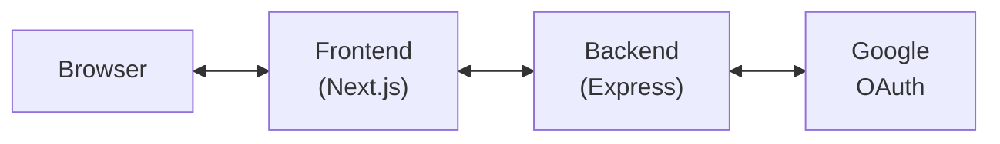
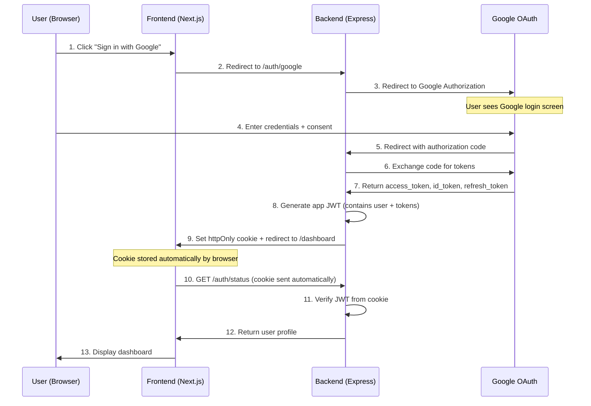
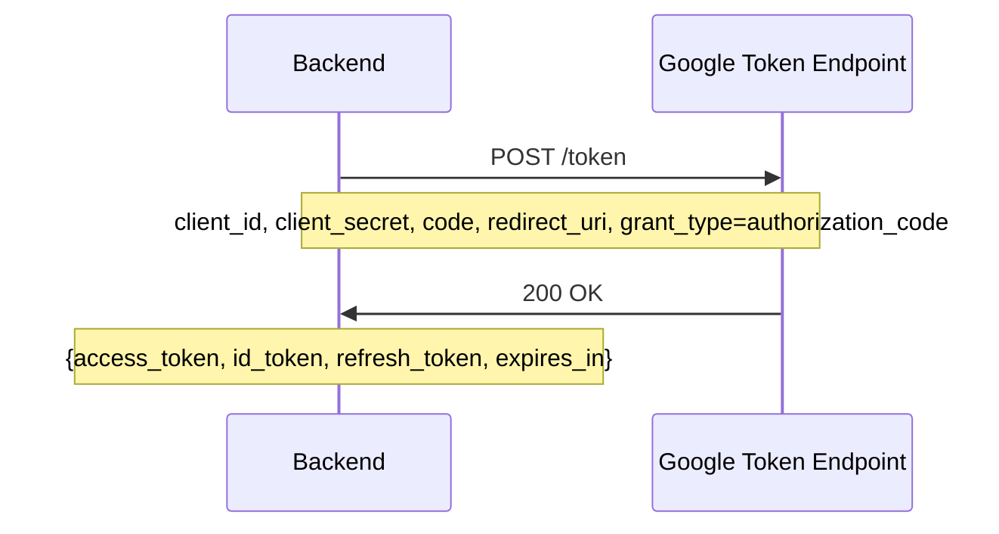
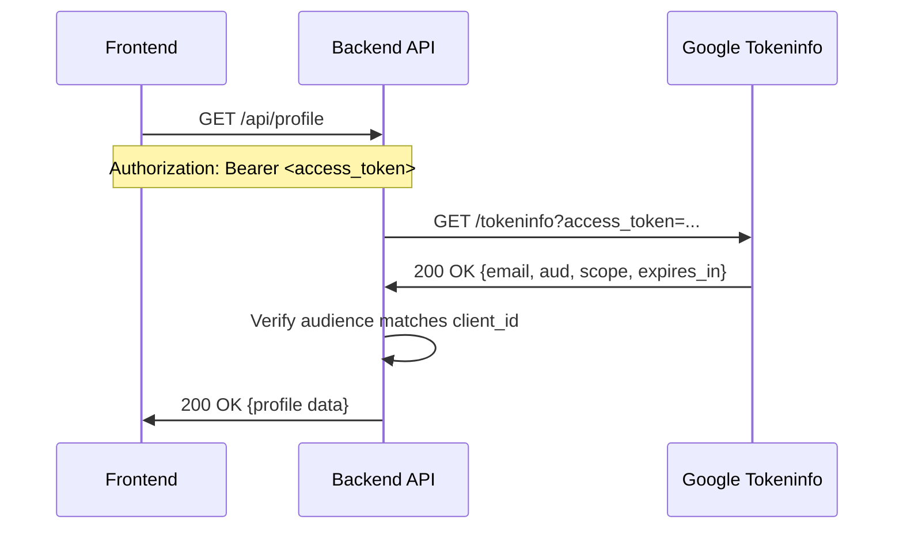

In this blog post we will walk through building a real Google OAuth implementation with Next.js and Express—step by step.

- **Next.js frontend** → initiates login, stores JWT, displays user profile
- **Express backend** → handles OAuth flow, issues JWTs, validates tokens
- **Google as Identity Provider** → Authorization Code Flow with OIDC scopes
- **JWT-based authentication** → stateless, scalable auth architecture
- **Protected API endpoints** → validates both app JWTs and Google access tokens

By the end, you'll have a working template for adding "Sign in with Google" to any web app.

{/* truncate */}

In [Part 2](/blog/2025/11/25/OAuth%202.0-OAuth%202.1-OIDC-&-SSO—a-practical-primer), we covered the theory behind OAuth 2.0, OpenID Connect, SSO, and tokens. Now it's time to get our hands dirty.

---

## The Mental Model: Auth is Just Redirects

Here's the insight that made OAuth finally click for me:

> **Auth is about redirects. If you understand redirects, you almost understand auth.**

Think about it. The entire OAuth dance is just a choreographed sequence of HTTP redirects:

1. **User clicks login** → Redirect to Google
2. **User authenticates** → Google redirects back with a code
3. **Backend exchanges code** → Redirect user to dashboard

No magic. No complex protocols happening in the browser. Just URLs bouncing the user around while servers talk to each other in the background.

The "security" part? It's all about **who controls each redirect** and **what gets passed in the URL vs. what stays server-side**. The authorization code never leaves the URL, but the actual tokens are exchanged server-to-server where the user can't intercept them.

Once you see OAuth as "redirect orchestration with server-side secrets," everything else—scopes, tokens, callbacks—becomes implementation details.


---

## What We're Building




**Use case:** This demo can be used as a starter template for adding Google authentication to any web application. Swap out Google for any OIDC-compliant provider (Okta, Auth0, Azure AD) with minimal changes.

---

## Step 0: Creating Google OAuth Credentials

Before writing any code, you need OAuth credentials from Google Cloud Console.
Google is the Identity Provider & Authorization Server.

### Steps:

1. Go to [Google Cloud Console](https://console.cloud.google.com/)
2. Create a new project (or select existing)
3. Navigate to **APIs & Services** → **Credentials**
4. Click **Create Credentials** → **OAuth client ID**
5. Select **Web application**
6. Configure:
   - **Name:** Your app name
   - **Authorized redirect URIs:** `http://localhost:3000/auth/google/callback`
7. Copy the **Client ID** and **Client Secret**

> ⚠️ **Important:** The redirect URI must exactly match what your backend expects. This is where Google sends the user after authentication.

### Grant Type: Authorization Code

We're using the **Authorization Code Flow**—the most secure OAuth flow for web applications with a backend. Here's why:

| Flow                   | Use Case              | Security                           |
| ---------------------- | --------------------- | ---------------------------------- |
| **Authorization Code** | Web apps with backend | ✅ Tokens never exposed to browser |
| Client Credentials     | Machine-to-machine    | N/A for user auth                  |
| Device Code            | TVs, CLI tools, IOT        | Good for limited-input devices     |

## The OAuth Flow — Big Picture

Before diving into code, let's visualize the complete flow:


---

## Step 1: Login Redirect — Starting the Flow

When a user clicks "Sign in with Google," we redirect them to our backend, which then redirects to Google.

### Frontend (Next.js)

```tsx
// frontend/src/app/page.tsx
const handleLogin = () => {
  window.location.href = `${BACKEND_URL}/auth/google`;
};
```

That's it on the frontend—just a redirect. The backend handles the complexity.

### Backend — Authorization Request

```javascript
// backend/src/routes/auth.js
router.get(
  "/google",
  passport.authenticate("google", {
    scope: ["openid", "profile", "email"], // OIDC scopes
    accessType: "offline", // Request refresh token
    prompt: "consent", // Always show consent screen
  })
);
```

#### What's happening here?

Passport.js constructs a URL like this and redirects the user:

```
https://accounts.google.com/o/oauth2/v2/auth?
  client_id=YOUR_CLIENT_ID
  &redirect_uri=http://localhost:3000/auth/google/callback
  &response_type=code           ← Authorization Code Flow
  &scope=openid profile email   ← OIDC scopes
  &state=xyz123                 ← CSRF protection
  &access_type=offline          ← To get refresh token
  &prompt=consent               ← Force consent screen
```

### Key Parameters Explained:

| Parameter       | Value                  | Purpose                                             |
| --------------- | ---------------------- | --------------------------------------------------- |
| `response_type` | `code`                 | We want an authorization code (not tokens directly) |
| `scope`         | `openid profile email` | OIDC scopes for identity + profile info             |
| `state`         | Random string          | CSRF protection—validated on callback               |
| `access_type`   | `offline`              | Request a refresh token                             |
| `prompt`        | `consent`              | Always show consent screen (good for demos)         |

:::info

To securely manage user authentication and authorization, it's crucial to keep tokens confidential. Obtaining tokens directly from Google would expose them to the client-side, making them vulnerable to cross-site scripting (XSS) attacks. By obtaining tokens from Google through the authorization code flow, tokens are not exposed to the client and are securely stored on the server.
:::

---

## Step 2: Callback Handling — Receiving the Code

After the user authenticates with Google, they're redirected back to your callback URL with an **authorization code**.

### Redirected from google to our backend with authorization code
```
http://localhost:3000/auth/google/callback?code=4/P7q7W91...&state=xyz123
```

### Backend Callback Handler

```javascript
// backend/src/routes/auth.js
router.get(
  "/google/callback",
  passport.authenticate("google", {
    failureRedirect: `${FRONTEND_URL}/login?error=oauth_failed`,
    session: false,
  }),
  (req, res) => {
    // Generate JWT containing user info and Google tokens
    const appJwt = generateAppJwt(req.user);

    // Redirect with JWT in URL fragment (not sent to server)
    res.redirect(`${FRONTEND_URL}/auth/callback#token=${appJwt}`);
  }
);
```

#### What Passport does under the hood:

1. **Validates the `state` parameter** → Prevents CSRF attacks
2. **Exchanges the code for tokens** → POST to Google's token endpoint
3. **Calls our verify callback** → With the tokens and profile
4. **Returns user object** → We then issue our own JWT

---

## Step 3: Token Exchange — Code for Tokens

This is the critical step that happens server-side. The authorization code is exchanged for real tokens.



### The Token Response

Google returns three tokens:

```json
{
  "access_token": "ya29.a0ARrdaM...",
  "id_token": "eyJhbGciOiJSUzI1NiIs...",
  "refresh_token": "1//04dK9q...",
  "expires_in": 3599,
  "token_type": "Bearer",
  "scope": "openid profile email"
}
```

### Passport Strategy — Processing Tokens

```javascript
// backend/src/config/passport.js
passport.use(
  new GoogleStrategy(
    {
      clientID: process.env.GOOGLE_CLIENT_ID,
      clientSecret: process.env.GOOGLE_CLIENT_SECRET,
      callbackURL: "http://localhost:3000/auth/google/callback",
      scope: ["openid", "profile", "email"],
    },
    (accessToken, refreshToken, params, profile, done) => {
      // params contains: id_token, expires_in, token_type, scope

      // Decode ID Token claims (JWT payload)
      const idTokenParts = params.id_token?.split(".");
      const idTokenClaims = JSON.parse(
        Buffer.from(idTokenParts[1], "base64").toString()
      );

      const user = {
        id: profile.id,
        email: profile.emails?.[0]?.value,
        name: profile.displayName,
        picture: profile.photos?.[0]?.value,
        tokens: {
          accessToken,
          idToken: params.id_token,
          refreshToken,
          idTokenClaims,
        },
      };

      return done(null, user);
    }
  )
);
```

---

## Step 4: Understanding the Tokens

You receive three types of tokens—each with a distinct purpose:

### ID Token (OIDC)

A **JWT** containing user identity claims. This is the "who you are" token.

```
eyJhbGciOiJSUzI1NiIs...  ← Header (algorithm, key ID)
.
eyJpc3MiOiJodHRwczovL...  ← Payload (claims)
.
SflKxwRJSMeKKF2QT4fw...  ← Signature
```

#### Decoded Claims:

| Claim     | Example                                     | Meaning                      |
| --------- | ------------------------------------------- | ---------------------------- |
| `iss`     | `https://accounts.google.com`               | Who issued the token         |
| `sub`     | `117730...`                                 | Unique user identifier       |
| `aud`     | `your-client-id.apps.googleusercontent.com` | Intended audience (your app) |
| `exp`     | `1702598400`                                | Expiration (Unix timestamp)  |
| `iat`     | `1702594800`                                | Issued at (Unix timestamp)   |
| `email`   | `user@gmail.com`                            | User's email                 |
| `name`    | `John Doe`                                  | User's display name          |
| `picture` | `https://lh3.google...`                     | Profile picture URL          |

> ⚠️ **Always verify the signature** in production! Never blindly trust the claims without cryptographic verification.

### Access Token

An **opaque token** (not a JWT for Google) used to call Google APIs on behalf of the user.

```
ya29.a0ARrdaM8J4x5KhTpZ9Q3...
```

- **Purpose:** Call Google APIs (Gmail, Drive, Calendar, etc.)
- **Lifetime:** ~1 hour
- **Validation:** Call Google's tokeninfo endpoint

### Refresh Token

A **long-lived token** used to obtain new access tokens without user interaction.

```
1//04dK9qXjFfG7yCgYIARAAGAQSNw...
```

- **Purpose:** Get new access tokens when they expire
- **Lifetime:** Until revoked
- **Storage:** Must be stored securely (encrypted, server-side)

---

## Step 5: JWT-Based Authentication

After successful OAuth, we issue our own JWT containing user info and Google tokens. This is the **Backend-for-Frontend (BFF)** pattern.

### Why Issue Our Own JWT?

| Approach                          | Pros                          | Cons                                         |
| --------------------------------- | ----------------------------- | -------------------------------------------- |
| **Session-based**                 | httpOnly cookies, secure      | Requires session storage, harder to scale    |
| **Google tokens directly**        | Simple                        | Short-lived, exposes Google tokens to client |
| **Our own JWT + httpOnly cookie** | Stateless, scalable, XSS-safe | CSRF risk (mitigated with sameSite)          |

### Generating the App JWT

```javascript
// backend/src/routes/auth.js
import jwt from "jsonwebtoken";

const JWT_SECRET = process.env.JWT_SECRET;
const JWT_EXPIRES_IN = "24h";

function generateAppJwt(user) {
  const payload = {
    sub: user.id,
    email: user.email,
    name: user.name,
    picture: user.picture,
    provider: "google",
    // Include Google tokens for API access
    tokens: {
      accessToken: user.tokens.accessToken,
      idToken: user.tokens.idToken,
      refreshToken: user.tokens.refreshToken,
    },
  };

  return jwt.sign(payload, JWT_SECRET, { expiresIn: JWT_EXPIRES_IN });
}
```

### OAuth Callback — Issue JWT in httpOnly Cookie

```javascript
router.get(
  "/google/callback",
  passport.authenticate("google", { session: false }),
  (req, res) => {
    const appJwt = generateAppJwt(req.user);

    // Set JWT as httpOnly cookie (JavaScript cannot access)
    res.cookie("auth_token", appJwt, {
      httpOnly: true,
      secure: process.env.NODE_ENV === "production",
      sameSite: "strict",
      maxAge: 24 * 60 * 60 * 1000, // 24 hours
    });

    res.redirect(`${FRONTEND_URL}/dashboard`);
  }
);
```


### Why httpOnly Cookies?

| Storage           | XSS Safe | CSRF Safe         | Persistence         |
| ----------------- | -------- | ----------------- | ------------------- |
| `localStorage`    | ❌       | ✅                | ✅ Survives refresh |
| `httpOnly cookie` | ✅       | ⚠️ (use sameSite) | ✅ Survives refresh |
| Memory only       | ✅       | ✅                | ❌ Lost on refresh  |

We use `httpOnly` + `sameSite: strict` for the best security balance:

- **httpOnly** → JavaScript cannot read the token (prevents XSS theft)
- **sameSite: strict** → Cookie not sent on cross-site requests (prevents CSRF)

---

## Step 7: Rendering the User Profile

After authentication, the browser automatically sends the httpOnly cookie with every request.

### Frontend — Fetching Auth Status

```tsx
// frontend/src/app/dashboard/page.tsx
const checkAuthStatus = async () => {
  const res = await fetch(`${BACKEND_URL}/auth/status`, {
    credentials: "include", // Send cookies cross-origin
  });
  const data = await res.json();

  if (data.authenticated) {
    setUser(data.user);
  } else {
    router.push("/");
  }
};
```

### Backend — JWT Verification Middleware

```javascript
// backend/src/middleware/validateToken.js
import jwt from "jsonwebtoken";

export async function verifyAppJwt(req, res, next) {
  const authHeader = req.headers.authorization;

  if (!authHeader?.startsWith("Bearer ")) {
    return res.status(401).json({ error: "Missing token" });
  }

  const token = authHeader.split(" ")[1];

  try {
    const decoded = jwt.verify(token, process.env.JWT_SECRET);
    req.user = decoded; // User info from JWT payload
    next();
  } catch (error) {
    return res.status(401).json({ error: "Invalid token" });
  }
}
```

### Backend — Auth Status Endpoint

```javascript
// backend/src/routes/auth.js
router.get("/status", verifyAppJwt, (req, res) => {
  res.json({
    authenticated: true,
    user: {
      id: req.user.sub,
      email: req.user.email,
      name: req.user.name,
      picture: req.user.picture,
    },
  });
});
```

---

## Step 7: Protected API Endpoints with Token Validation

Now for the real power—protecting your API endpoints by validating access tokens.

### The Flow:



### Token Validation Middleware

```javascript
// backend/src/middleware/validateToken.js
export async function validateToken(req, res, next) {
  const authHeader = req.headers.authorization;

  if (!authHeader || !authHeader.startsWith("Bearer ")) {
    return res.status(401).json({
      error: "Missing or invalid Authorization header",
      hint: "Use format: Authorization: Bearer <access_token>",
    });
  }

  const token = authHeader.split(" ")[1];

  try {
    // Validate with Google
    const response = await fetch(
      `https://oauth2.googleapis.com/tokeninfo?access_token=${token}`
    );

    if (!response.ok) {
      throw new Error("Invalid token");
    }

    const tokenInfo = await response.json();

    // Verify the token was issued for YOUR app
    if (tokenInfo.aud !== process.env.GOOGLE_CLIENT_ID) {
      return res.status(401).json({
        error: "Token was not issued for this application",
      });
    }

    req.tokenInfo = tokenInfo;
    req.userEmail = tokenInfo.email;
    next();
  } catch (error) {
    return res.status(401).json({
      error: "Invalid or expired token",
    });
  }
}
```

### Protected API Endpoint

```javascript
// backend/src/routes/api.js
router.get("/profile", validateToken, (req, res) => {
  res.json({
    message: "Token validated successfully!",
    tokenInfo: {
      email: req.tokenInfo.email,
      scope: req.tokenInfo.scope,
      expiresIn: req.tokenInfo.expires_in,
    },
  });
});
```

---


## Wrapping Up

We've built a complete OAuth 2.0 + OIDC implementation from scratch. Here's what we covered:

1. **Setting up Google OAuth credentials** — Creating client ID/secret
2. **Authorization Code Flow** — The secure way to authenticate
3. **Login redirect** — Starting the OAuth dance
4. **Callback handling** — Receiving the authorization code
5. **Token exchange** — Code for access_token, id_token, refresh_token
6. **Token types** — Understanding what each token does
7. **JWT-based auth** — Issuing our own JWTs after OAuth
8. **Stateless authentication** — No server-side session storage
9. **User profile rendering** — Displaying OIDC claims from JWT
10. **Protected API endpoints** — JWT + Google token validation

### What's Next?

In Part 4, we'll explore:

- Token refresh implementation
- Integrating with enterprise IdPs (DUO, Okta, Azure AD, Ory Kratos)
- PKCE for public clients (SPAs, mobile apps)
- Logout flows (local + IdP-initiated)

---

## Resources

- [Google OAuth 2.0 Documentation](https://developers.google.com/identity/protocols/oauth2)
- [OpenID Connect Spec](https://openid.net/connect/)
- [OAuth 2.0 RFC 6749](https://datatracker.ietf.org/doc/html/rfc6749)
- [Demo Repository](https://github.com/akshaydwarakanath/google-oauth-oidc-demo)

---

_Tags: oauth, oidc, google-auth, nodejs, nextjs, express, authentication, security, tokens, jwt_
